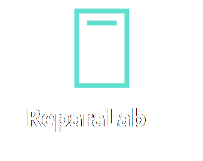

# ReparaLab

Aplicaci?n de escritorio para gestionar la operaci?n de un taller de reparaci?n de dispositivos m?viles. Es una versi?n de portafolio derivada de una herramienta que desarroll? durante mis primeros a?os de aprendizaje de Java y que se us? en un negocio real. El nombre, los gr?ficos, la conexi?n y los datos del negocio no forman parte de esta publicaci?n.

## Funciones existentes

| Rol | Trabajo principal |
| --- | --- |
| Administrador | Usuarios, clientes, equipos, art?culos, ventas, informaci?n de tickets y cortes |
| Capturista | Recepci?n de equipos, clientes, ventas, turnos y cortes |
| T?cnico | Consulta y seguimiento del estado de los equipos |

La aplicaci?n tambi?n genera ?rdenes de servicio, tickets y PDF. No se a?adieron m?dulos nuevos para esta versi?n.

## Tecnolog?a

- Java 25 como nivel de compilaci?n y Swing con formularios de NetBeans
- [Alcance y validacion de la migracion a Java 25](docs/java-25-upgrade.md)
- Maven
- MySQL Connector/J 8.4
- JasperReports 7.0.8 para ?rdenes de servicio
- iText 5.5 para PDF

La plantilla JRXML se adapt? a JasperReports 7 para incorporar la correcci?n de seguridad de esa serie.

## Adaptar ReparaLab a un taller

ReparaLab se conserva como base de las funciones existentes. Para adaptarlo a otro negocio:

1. Crea una base de datos propia a partir de `database/demo.sql`. Sustituye los usuarios y datos ficticios. No publiques una copia con datos de clientes ni contrase?as reales.
2. Configura `APP_DB_URL`, `APP_DB_USER` y `APP_DB_PASSWORD` en el equipo de ejecuci?n. Comprueba que el usuario de MySQL tenga ?nicamente los permisos necesarios.
3. Revisa los datos del negocio, las condiciones de recepci?n y los textos de los documentos generados. Sustituye las im?genes gen?ricas por recursos propios si corresponde.
4. Comprueba localmente cada rol y los flujos de alta, consulta, orden de servicio, venta, PDF e impresi?n con datos de prueba.
5. Consulta [requirements.txt](requirements.txt), [avisos de terceros](THIRD-PARTY-NOTICES.md) y la secci?n de licencia antes de distribuir una adaptaci?n.

La aplicaci?n usa rutas relativas para `images/` y `reports/`; conserva estos directorios junto al ejecutable y ejec?talo desde su ra?z. La plantilla de GitHub conserva el contenido del repositorio y crea un historial nuevo; no sustituye la configuraci?n del negocio ni concede permisos de uso adicionales.

## Ejecutar una demostraci?n local

Requiere JDK 25 o posterior, Maven 3.9.12 o posterior y una instancia local de MySQL 8. El esquema de database/demo.sql fue reconstruido a partir del c?digo para esta demostraci?n y contiene solamente datos ficticios.

1. Importa database/demo.sql en MySQL. Crea un usuario local con permisos sobre reparalab_demo.
2. Configura las variables de entorno de la aplicaci?n. Por ejemplo, en PowerShell:

       $env:APP_DB_URL = 'jdbc:mysql://localhost:3306/reparalab_demo'
       $env:APP_DB_USER = '<usuario_local>'
       $env:APP_DB_PASSWORD = '<contrase?a_local>'

3. Desde la ra?z del repositorio, ejecuta:

       mvn clean install
       java -jar target/ReparaLab-3.0.0.jar

El proceso debe iniciarse desde la ra?z para encontrar los directorios images/ y reports/. El comando install copia las dependencias a target/lib/. La aplicaci?n no incluye un servidor MySQL ni crea autom?ticamente la base de datos.

Cuentas de ejemplo: admin, capturista y tecnico. Cada una usa la contrase?a demo1234. Son cuentas ficticias para uso local; cambia o elimina estas credenciales si reutilizas el esquema.

## Organizaci?n

- src/main/java/gui: ventanas y di?logos Swing
- src/main/java/com/bd: acceso a MySQL
- src/main/java/com/construir y com/eventos: tablas e interacci?n
- src/main/java/com/cortes y com/Ticket*: cierres y comprobantes
- reports: plantilla fuente JRXML
- database: esquema y usuarios de ejemplo

## Alcance y l?mites

Esta copia no incluye historial del repositorio privado, credenciales de la instalaci?n original, datos de clientes ni im?genes del negocio. Las contrase?as de nuevas cuentas se guardan con PBKDF2 y las consultas directas y filtros de b?squeda usan par?metros. La integraci?n de escritorio con MySQL e impresoras requiere validaci?n manual en un entorno local; el CI verifica compilaci?n y pruebas automatizadas de contrase?as y de la orden de servicio.

El dise?o original conserva decisiones de una aplicaci?n temprana, como SQL en componentes de interfaz y rutas de archivos relativas. Se documentan para presentar el trabajo con precisi?n, sin atribuirle una arquitectura que no tiene.

## Autor

Diego Arambula.

## Licencia y estado de publicaci?n

El repositorio est? **privado** y no hay un release v1.0.0 publicado. El c?digo de esta revisi?n conserva la [AGPLv3](LICENSE), que se eligi? para distribuirlo con iText 5. Esa licencia permite copiar, modificar y redistribuir bajo sus condiciones; no cumple el objetivo de impedir que terceros usen la aplicaci?n sin adaptarla. Adem?s, cambiar la licencia de una versi?n posterior no retira los permisos ya concedidos sobre copias anteriores.

Antes de distribuir una versi?n con t?rminos restrictivos hay que sustituir iText 5 y revisar el efecto de MySQL Connector/J (GPLv2 con Universal FOSS Exception) y de las dem?s dependencias. La licencia de las bibliotecas no cambia al modificar la licencia del c?digo propio. Consulta el [inventario de terceros](THIRD-PARTY-NOTICES.md). Este repositorio no es una oferta de licencia comercial ni un paquete listo para distribuir bajo t?rminos restrictivos.

La primera versi?n est? descrita como borrador en [CHANGELOG.md](CHANGELOG.md) y [notas v1.0.0](docs/releases/RELEASE-v1.0.0.md). La [plantilla de notas](docs/releases/TEMPLATE.md) gu?a futuros releases.
